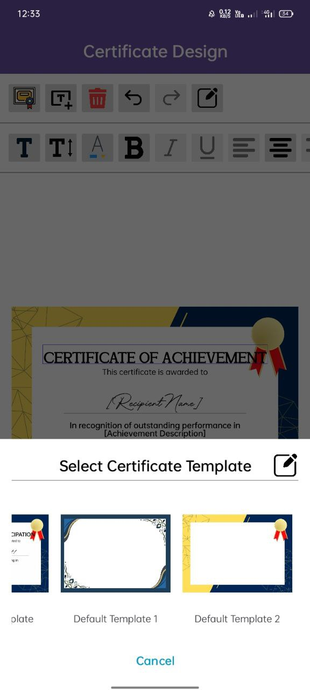

# Event Hive

Event Hive is a mobile-based Event Management System designed to simplify the process of organizing, managing, and attending events. Built with Firebase Authentication, Cloud Firestore, and Firebase Storage, the platform integrates essential event functions into a single, user-friendly application for participants, organizers, and administrators.

## Key Features
- Secure login and registration via Firebase Authentication.
- Browse events and register with auto-generated QR codes for check-in.
- View past, current, and upcoming events.
- Download and export event certificates.
- Manage event details, registrations, and attendee check-ins.
- Upload customizable certificate templates for automatic certificate generation.
- Access analytics and reports on attendance and revenue.

## My Role
I was responsible for designing and implementing the certificate module. This module allows organizers to fully manage certificates for their events—from creating and editing certificate designs to selecting templates, adding or removing text and placeholders, customizing fonts, colors, and alignments, and managing templates specific to each event. The module supports both participation and achievement certificates, with placeholders like recipient name, event details, and achievement descriptions automatically replaced during generation. Organizers can filter participants, assign achievements in bulk or individually, and generate multiple certificates in one process. The system also provides undo/redo functionality, flexible template uploads, and PDF export for participants, ensuring a streamlined, professional, and highly customizable certificate generation process.

## Screenshots

